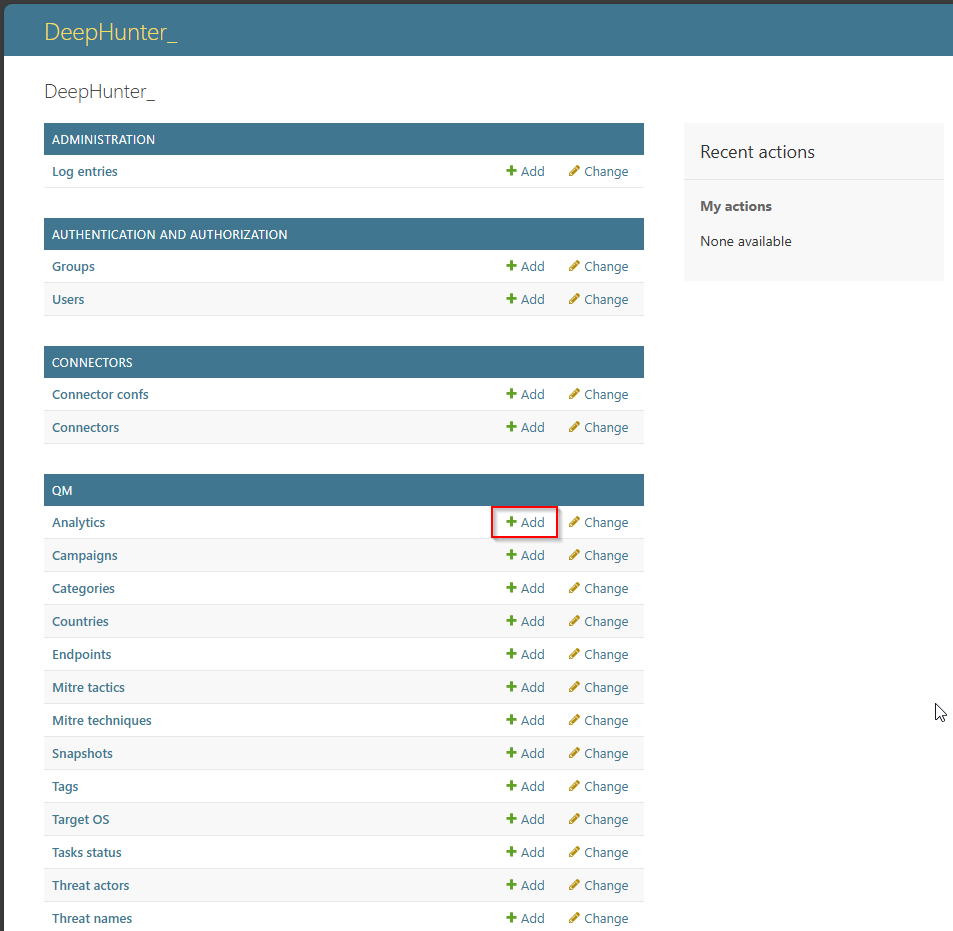
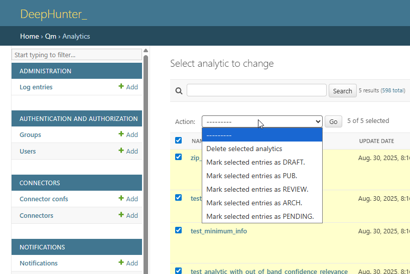

Admin
#####

The database model
******************

* **Administration**

  * **Log entries**: actions logs (native to Django, and different from the history tracking accessible from the `analytic details header information <modules/analytics.html#id1>`_).

* **Authentication and Authorization**

  * **Groups**: List of groups (``manager`` and ``viewer``)
  * **Users**: List of users (even if you are relying on PingID, a local copy of the user is kept in the database, in order to track user actions).

* **Qm**

  * **Analytics**: List of threat hunting analytics.
  * **Campaigns**: List of `campaigns <intro.html#campaigns>`_ (daily jobs) and `stats regeneration jobs <modules/analytics.html#actions-buttons>`_.
  * **Categories**: Used to assign threat hunting analytics to categories (e.g. detect, triage, threat hunting).
  * **Celery status**: 	Table used to monitor background celery jobs (when a user regenerates statistics).
  * **Countries**: List of countries, associated to threat actors.
  * **Endpoints**: List of endpoints matching threat hunting queries ran by campaigns.
  * **Mitre tactics**: List of MITRE tactics (DeepHunter comes with a fixture to load this table).
  * **Mitre techniques**: List of MITRE techniques (DeepHunter comes with a fixture to load this table).
  * **Snapshots**: Table linking Campaigns and Endpoints.
  * **Tags**: List of tags for threat hunting analytics.
  * **Target OS**: List of Operating Systems for threat hunting analytics coverage.
  * **Threat actors**: List of threat actors that threat hunting analytics can be linked to.
  * **Threat names**: List of threat names that threat hunting analytics can be linked to.
  * **Vulnerabilities**: List of vulnerabilities (CVE) that threat hunting analytics can be linked to.

The detailed model is available `here <https://github.com/sebastiendamaye/deephunter/blob/main/qm/models.py>`_.

Logout
******
This option terminates the user session and redirects to the login page.

Debug
*****
The debug information can be used to check error messages (e.g., generated by campaigns). Only users with the ``is_superuser`` flag will see this entry in the menu.

Backend
*******
Points to the Django backend (admin pages).

Create/modify threat hunting analytics
**************************************
To create a new threat hunting analytic, go to the Django backend (``/admin`` URL) and click on the ``+ Add`` link on the right side of the ``Analytics`` table.

Fields should be quite explicit, and it shouldn't be too complicated for you to create new threat hunting analytics. There are some points you should consider though:

- **Query vs Columns**: The query field is composed of the query itself and some columns (optionnaly grouped). In DeepHunter, you should split both. Anything that is modifying the number of results (e.g., filters) should be in the ``Query`` field, while presentation parameters (e.g., ``| columns``, ``| group``) should appear in the ``Columns`` field. See the examples of threat hunting analytics shipped with the installation package for more details.
- **Markdown syntax**: Some fields (e.g., description, notes, emulation validation) use the markdown syntax.
- The **reference** field accepts URL directly (1 URL per line)
- You can create threat actors, threat names or vulnerabilities directly from a threat hunting analytic, by using the ``+`` icon on the right side of these fields.

To clone an analytic, just edit the analytic you wish to clone, change its name, and click the "Save as new" button.

Bulk actions
************

Native actions (UI)
-------------------
It is possible to perform bulk actions on multiple threat hunting analytics at once. To do this, select the desired analytics from the list view and choose an action from the **Actions** dropdown menu. The available actions include:

- Delete analytics
- Mark as Draft
- Mark as Published
- Mark as Under Review
- Mark as Archived
- Mark as Pending

After selecting an action, click the **Go** button to apply the action to all selected analytics.

Advanced actions (Django shell)
-------------------------------
For other actions, you may need to edit each analytic individually, or use the native Django shell, as depicted in the example below.

First open the shell:

.. code-block:: bash

    $ source /data/venv/bin/activate
    $ cd /data/deephunter
    $ ./manage shell

Once in the shell, you can run commands to interact with the database and perform actions on the threat hunting analytics. The example below shows how to disable the `run_daily` flag for analytics imported via the `deephunter_analytics` repository.

.. code-block:: python

    >>> repo = Repo.objects.get(name='deephunter_analytics')
    >>> analytics = Analytic.objects.filter(repo=repo)
    >>> analytics.update(run_daily=False)
