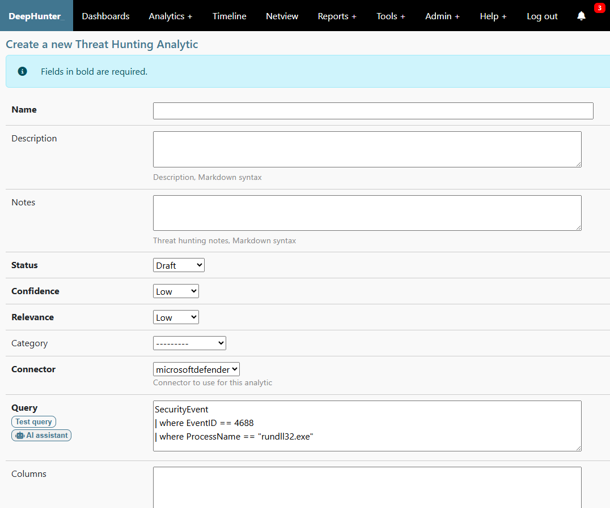
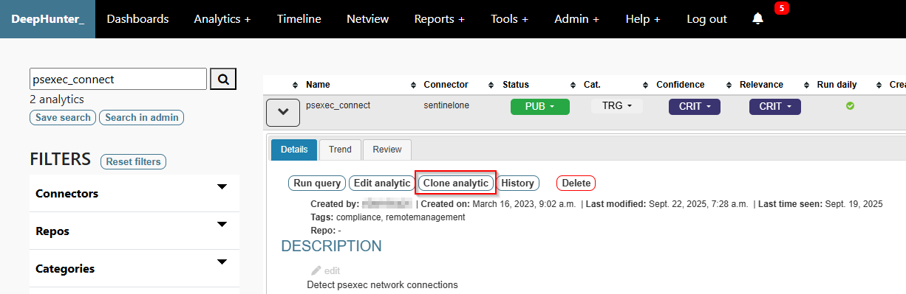

Create or modify threat hunting analytics
#########################################

To create a new threat hunting analytic, go to the **Aalytics > Create analytic** menu.

You can also create a threat hunting analytic by cloning an existing one. To do this, go to the **Analytics** page, expand the threat hunting analytic you want to clone, and click on the **Clone analytic** button. This will open the threat hunting analytic form pre-filled, without a name. You can then modify it as needed and save it.

