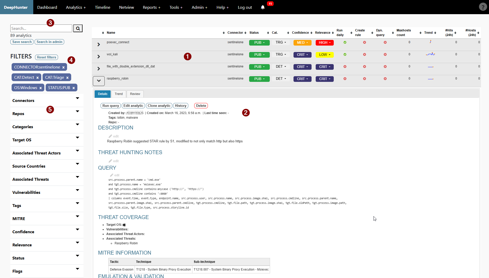
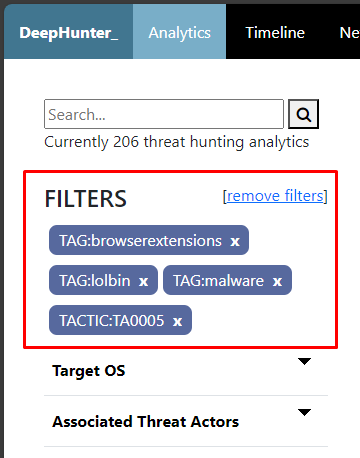
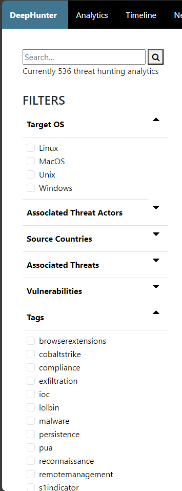
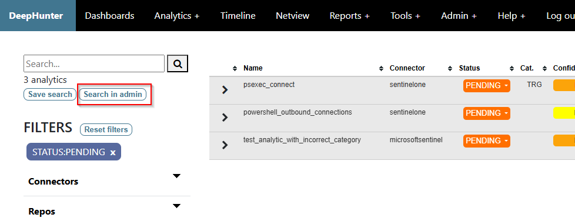

List Analytics
##############

Interface
*********
Refer to the objects number for details.

1. `List of analytics <#list-of-threat-hunting-analytics>`_
2. `Threat hunting analytic details <#id1>`_
3. `Search form <#id2>`_
4. `Selected filters <#id3>`_
5. `Available filters <#id4>`_

List of threat hunting analytics
********************************
This shows the list of threat hunting analytics available in the DeepHunter database. For each, you will have information shown in columns (clicking on the column header sorts the list):

- **Name**: name of the analytic
- **Connector**: connector used for each analytic
- **Status**: Status of the analytic in the `worklfow <../intro.html#analytic-workflow>`_. Clicking on a status will show a dropdown list with possible statuses that you can choose to update the analytic. This is automatically refreshed every 10 seconds.
- **Category**: Category of the analytic
- **Confidence**: the confidence indicator (CRIT, HIGH, MED, LOW) tells how much you can trust the analytic. If it tends to output many "false positives", the confidence will likely be "LOW". On the other hand, a confidence of "CRIT" means that all matching events are real alerts.
- **Relevance**: The relevance (CRIT, HIGH, MED, LOW) tells how bad it is for your organization if events match the threat hunting analytic, independantly from the confidence. Understand it as the "impact". It may happen that you have an analytic that matches many events, only some of which are interesting/relevant. However, you may still want to keep this rule as matches may indicate a sign of compromise. In this case, the rule may have a low confidence, with a critical relevance.
- **Run daily**: Flag indicating if the analytic is run daily (via the campaigns cron job). Remember that DeepHunter is a repository storing all threat hunting analytics, but not all of them may need to be automated. This flag is automatically refreshed every 10 seconds.
- **Create rule**: Flag indicating if the analytic has a matching rule in the remote data lake. When you modify an analytic in DeepHunter, it will also update the remote corresponding rule. Deleting a threat hunting analytic associated to a rule will automatically delete the rule in the remote data lake. Notice that the remote rules will have their name based on the threat hunting analytic in DeepHunter. For that reason, a best practice is to name all of your analytics using characters in ``a-z``, ``0-9`` and replace spaces with ``_``.
- **Dyn query**: Flag that indicates if the analytic is `static or dynamic <intro.html#static-vs-dynamic-analytics>`_.
- **Maxhosts count**: Counts how many times ``CAMPAIGN_MAX_HOSTS_THRESHOLD`` is reached. This counter is used (check ``ON_MAXHOSTS_REACHED``) to automatically remove threat hunting analytics from future campaigns and/or delete associated statistics.
- **Trend**: sparkline showing the trend (based on statistics collected by the campaigns) for the last 20 days.
- **Hits (24h)**: Number of matching events for the last 24h, according to the last campaign.
- **Hosts (24h)**: Number of matching unique endpoints for the last 24h, according to the last campaign.

Threat hunting analytic details 
*******************************

Details of each analytic can be viewed by clicking on the arrow on the left of each analytic name. There are 3 tabs:

- **Details**: shows all information about the threat hunting analytic (description, PowerQuery, threat coverage, MITRE information, references, etc.). See the `Analytic details tab page <details.html>`_ for more information.
- **Trend**: shows the historical statistics collected by the campaigns for this threat hunting analytic. See the `Analytic trend tab page <trend.html>`_ for more information.
- **Review**: Show the `Review page <review.html>`_ for the selected analytic.

Search form
***********
Search for a string in the threat hunting analytics names, descriptions and threat hunting notes.

Selected filters
****************
List of applied filters. Click on the cross sign to remove a specific filter.

Available filters
*****************
The list of all possible filters, broken down into sections. Expand a section and select a filter. It will be immediately added to the list of selected filters and the page will refresh. You can add as many filters as you want. Filters from the same section are applied as a list of values (for example, if you select "Windows" and "Linux" as "Target OS", it will show the list of threat hunting analytics that cover "Windows" or "Linux").

Bulk actions
************
It is possible to perform bulk actions on multiple threat hunting analytics at once. To do this, do a search and click the **Search in admin** button. It will send the search to the admin panel where you will be able to do `bulk actions <../admin.html#bulk-actions>`_, including deleting analytics, and updating the status.

