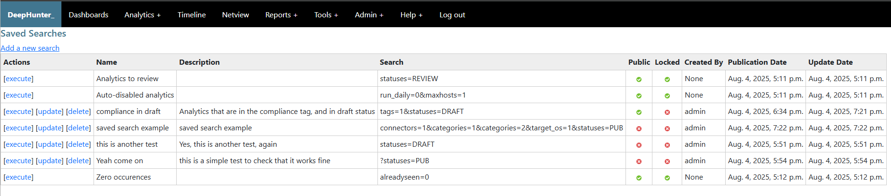

Saved Searches
##############

Saved searches are a way to save a search query and its filters, so you can quickly access it later. This is useful if you often search for the same criteria.

There are public saved searches and private saved searches. Public saved searches are available to all users, while private saved searches are only available to the user who created them.

You can also lock a search (useful for public saved searches) so that no one can modify or delete it.

The checkbox acts as a toggle to switch between all saved searches or only saved searches created by the logged in user. By default, all saved searches are shown.

