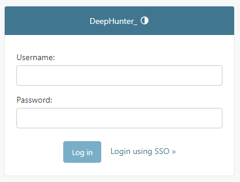
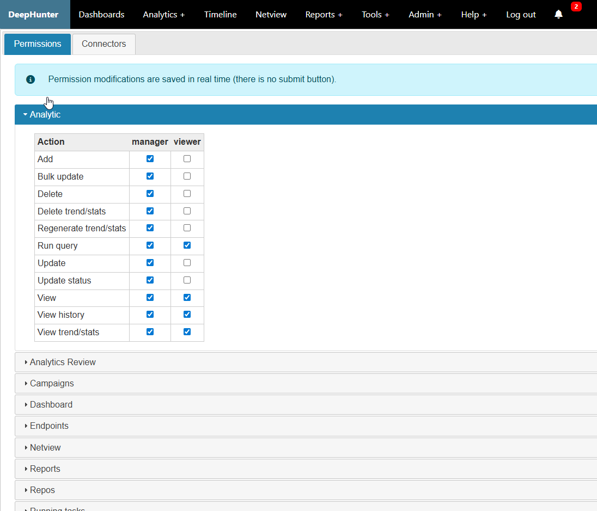

Authentication, Groups and Privileges
#####################################

Authentication modes
********************
DeepHunter currently supports 3 authentication modes:

- **local**: this is the native Django authentication where usernames and passwords are stored in the local database.
- **PingID**: this authentication relies on `PingIdentity Single Sign-On <https://www.pingidentity.com/en/platform/capabilities/single-sign-on.html>`_.
- **Entra ID**: this authentication relies on `Microsoft Entra ID <https://learn.microsoft.com/en-us/entra/fundamentals/whatis>`_.

The login screen will look as follows if you haven't set ``LOGIN_FORM`` to ``False`` in the settings. Else, only the ``Login with SSO`` link will appear.

Local authentication
********************
This is the native Django authentication. Start by creating a super user

.. code-block::

	$ source /data/venv/bin/activate
	(venv) $ ./manage.py createsuperuser

Once a super user has been created, you should be able to access the backend of DeepHunter (``https://deephunter_url/admin``) and manage groups and users.

PingID
******

To use PingID:

- modify the necessary settings (check the `settings <settings.html#authlib-oauth-clients>`_ page) related to PingID configuration.
- set ``AUTH_PROVIDER`` to ``pingid``.
- Create 2 Active Directory (AD) groups: for example ``deephunter_usr`` (standard user, with read-only access) and ``deephunter_pr`` (privileged users, i.e., administrators) and assign users to these groups.
- In the settings, do the correct mapping for the ``USER_GROUPS_MEMBERSHIP`` variable.
- You'll need to assign correct values for the ``AUTH_TOKEN_MAPPING`` variable. You can use the debug return function of ``./deephunter/views.py`` on line 64 to check the token values to do this mapping.
- Optionnaly disable the login form (set ``LOGIN_FORM`` to ``False`` in the settings)
- When a user logs in, if the authentication is successful, information from AD will be gathered to update the user in the local database.

Entra ID
********

To use Entra ID:

- modify the necessary settings (check the `settings <settings.html#authlib-oauth-clients>`_ page) related to Entra ID configuration.
- set ``AUTH_PROVIDER`` to ``entra_id``.
- Create roles in Entra ID, for example ``deephunter_usr`` (standard user, with read-only access) and ``deephunter_pr`` (privileged users, i.e., administrators) and assign users one of these roles.
- In the settings, do the correct mapping for the ``USER_GROUPS_MEMBERSHIP`` variable.
- You'll need to assign correct values for the ``AUTH_TOKEN_MAPPING`` variable. You can use the debug return function of ``./deephunter/views.py`` on line 64 to check the token values to do this mapping.
- Optionnaly disable the login form (set ``LOGIN_FORM`` to ``False`` in the settings)
- When a user logs in, if the authentication is successful, information from the session token will be gathered to update the user in the local database.

Groups and Privileges
*********************

Local and AD Groups
===================

If you are relying on local authentication, you can create groups and assign privileges using the backend of DeepHunter.

If you are relying on PingID or Entra ID, you need to create groups in the local database that will be mapped to the AD groups or Entra ID roles. Use the ``USER_GROUPS_MEMBERSHIP`` variable in the settings to do this mapping.

In the example below, the AD groups or Entra ID roles ``deephunterdev_usr``, ``deephunterdev_pr`` and ``deephunterdev_th`` are mapped to the local groups ``viewer``, ``manager`` and ``threathunter`` respectively.

.. code-block:: python

    USER_GROUPS_MEMBERSHIP = {
        'viewer': 'deephunterdev_usr',
        'manager': 'deephunterdev_pr',
        'threathunter': 'deephunterdev_th',
    }

Privileges
==========

Privileges are assigned to groups. Use the User Interface to assign privileges to groups.

