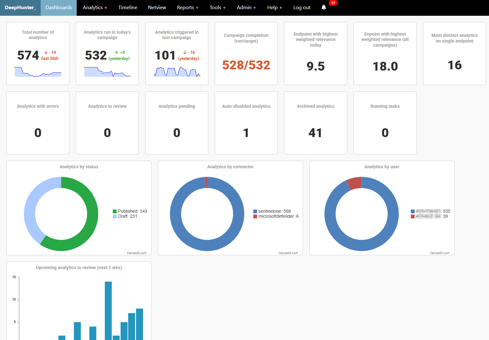

Dashboard
#########

This is the home page of DeepHunter. It is loaded with several widgets, that are clickable to redirect to the detailed views.

Available widgets:

* **Total number of analytics**: Total number of threat hunting analytics available in DeepHunter, with trend since last month.
* **Analytics run in today's campaign**: number of analytics with the "run daily" flag set (targeted in today's campaign). If no error occurred, this number should match the total number of analytics run (see campaign completion widget).
* **Analytics triggered in last campaign**: number of analytics that triggered events in the last campaign. 
* **Campaign completion (run/target)**: this widget is useful to monitor the completion of the campaign. It shows the number of analytics that were successfully run, over the total number of analytics targeted in the campaign (analytics with the "run daily" flag set). If this number is below 100%, it means that some analytics failed to run (check the "analytics with errors" widget).
* **Endpoint with highest weighted relevance today**: cumulated weighted relevance (involving relevance and confidence of each threat hunting analytic) for the endpoint that has the highest score in the last campaign.
* **Enpoint with highest weighted relevance (all campaigns)**: highest cumulated weighted relevance (involving relevance and confidence of each threat hunting analytic of all time*).
* **Most distinct analytics on single endpoint**: endpoint with the highest number of distinct threat hunting analytics that triggered events (all time*).
* **Analytics with errors**: number of analytics that encountered errors when being run in the last campaign. Click on the widget to get the list of analytics with errors.
* **Analytics to review**: number of analytics that are pending review (identified by daily cron). Click on the widget to get the list of analytics to review.
* **Analytics pending**: number of analytics that are pending update in the last campaign. Click on the widget to get the list of pending analytics.
* **Auto-disabled analytics**: number of analytics that were automatically disabled because they triggered too many events (as defined in the settings) or have errors. Click on the widget to get the list of auto-disabled analytics.
* **Archived analytics**: number of archived analytics. Click on the widget to get the list of archived analytics.
* **Running tasks**: Live number of running tasks (Celery workers).
* **Analytics by status**: Analytics broken down by status (active, pending, archived, auto-disabled, disabled).
* **Analytics by connector**: Analytics broken down by connector (SentinelOne, Microsof Defender XDR, etc.)
* **Analytics by user**: Analytics broken down by user (author).
* **Upcoming analytics to review (next 2 wks)**: Graphic showing the number of analytics to review in the next 2 weeks, based on their next_review_date. Click on the widget to load the full graph.

(*) considering the retention period defined in the settings.
