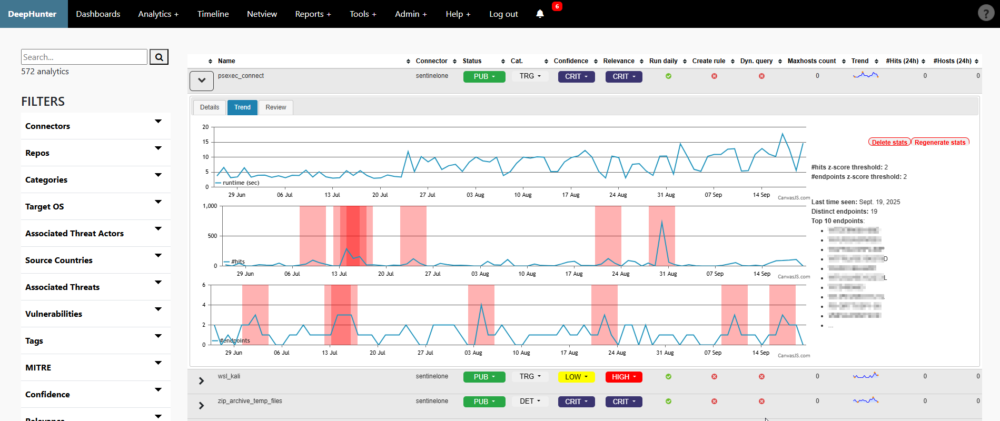
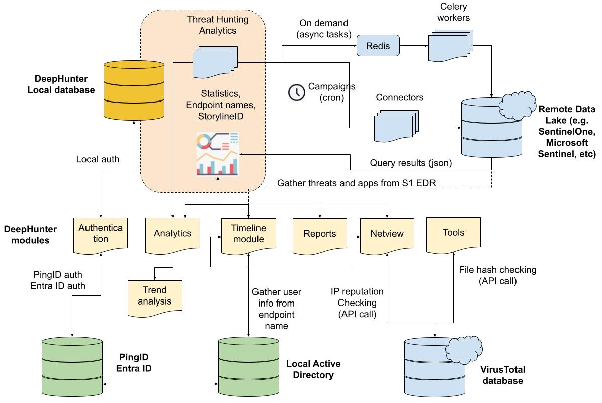
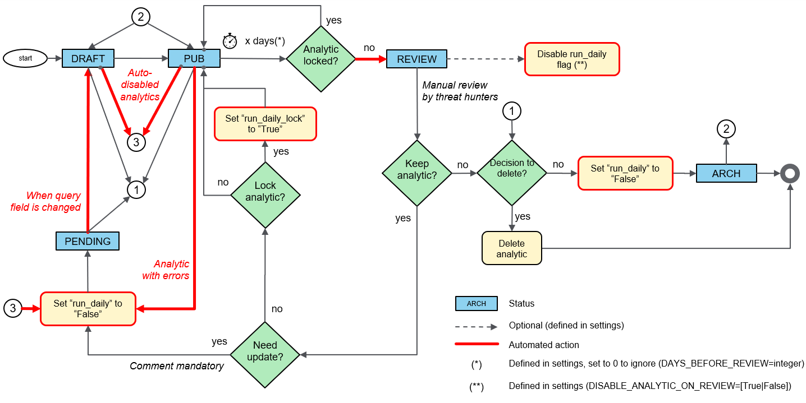
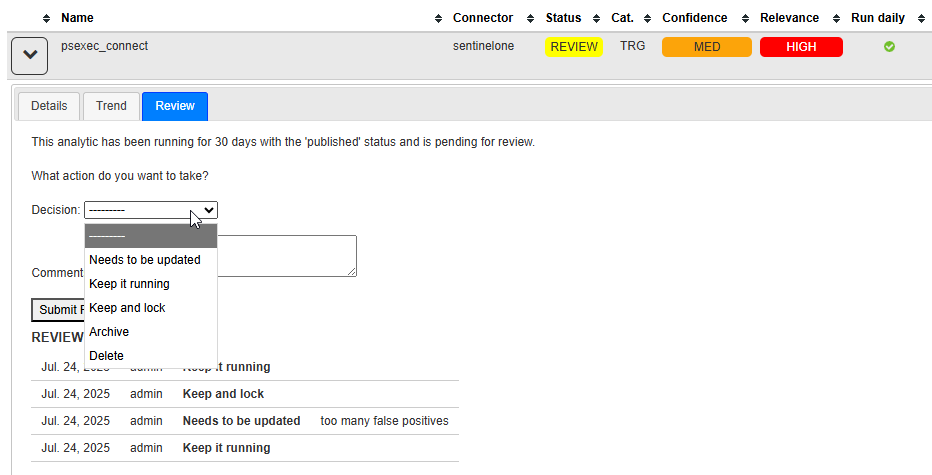

Introduction
############

What is DeepHunter?
*******************
DeepHunter is a Threat Hunting platform that features:

- `Repository <modules/analytics.html>`_ for your threat hunting analytics shown in a sortable table.
- `Search and filters <modules/analytics.html#id4>`_ (description, threat hunting notes, tags, query, OS coverage, vulnerabilities, threat actors, threat names, MITRE coverage, etc.) to find particular threat hunting analytics or group them into hunting packages.
- `Automated execution <intro.html#campaigns>`_ of threat hunting queries in daily campaigns and collection of daily statistics (number of matching events, number of matching endpoints, etc).
- `Trend analysis <modules/trend.html>`_ with automatic detection of statistical anomalies.
- `Timeline view <modules/timeline.html>`_ of the distribution of threat hunting analytics for a given endpoint.
- `Network view <modules/netview.html>`_ module to analyze network activities from a host, with highlights on the destination popularity (based on your environment) and VirusTotal reputation.
- Reports (`Campaigns performance report <reports_stats.html>`_, `Top endpoints identified in the last campaign <reports_endpoints.html>`_, `MITRE coverage <reports_mitre_coverage.html>`_, `List of analytics with missing MITRE coverage <reports_missing_mitre.html>`_)
- Tools (`LOL Driver Hash Checker <tools_lol_drivers_hash_checker.html>`_, `VirusTotal Hash Checker <tools_vt_hash_checker.html>`_, `Whois <tools_whois.html>`_).

Who is DeepHunter for?
**********************
DeepHunter is an application developed by threat hunters for threat hunters, in order to automate the execution of threat hunting queries, and prioritize threat hunts. It is not intended to replace the EDR or the SDL, but it will dramatically help threat hunters organize their threat hunting campaigns. Targeted populations are:

- **Threat Hunters**: DeepHunter may quickly become your day-to-day threat hunting platform.
- **SOC analysts**: DeepHunter timeline module can help you triage incidents, or correlate a reported incident with other artifacts.
- **Incident Responder/Analyst**: DeepHunter timeline can show you since when a particular behavior exists, whether it has been identified as a threat by your EDR, whether it could be linked to an installed application, etc..

What data lakes are supported?
******************************
DeepHunter (from v2.0) has been designed to connect to the any data lake, provided there is a connector, or you develop one. There are already connectors for `SentinelOne <https://www.sentinelone.com/>`_ EDR and for Microsoft Sentinel, but this list is expected to grow. You are very welcome to contribute.

Architecture
************

Campaigns and Statistics
************************

Campaigns
=========
The purpose of DeepHunter is to automate the execution of threat hunting analytics (the ones with the ``run_daily`` flag set) each day. This is done through campaigns.

A Campaign is a cron job running every day at the same time. It executes the analytics, and collects statistics (number of matching events, number of endpoints, etc.) for each analytic every day for the last day (24 hours time range), creating a baseline (trend analysis) for each analytic. A z-score based model is then applied on these statistics to identify potential statistical anomalies.

Whenever the cron job is scheduled during the day, it will query the data from the previous day.

Statistics regeneration
=======================
It may happen that you modify a threat hunting query for various reasons (e.g., add a filter to exclude some results). When you do so, statistics for the updated query will change. If you want to apply the same logic to all past statistics, as if the query would have always been as you just changed it, you can regenerate the statistics for this threat hunting query. It will work on the background and show the percentage of completion as shown below.

Statistics can be automatically regenerated for new analytics, or when the query field of existing analytics is modified. This is controlled by the ``AUTO_STATS_REGENERATION`` setting.

Thresholds, error detection and automation
==========================================

In order to prevent the database from being overwhelmed with useless information, several thresholds and automatic actions are available in the `settings <settings.html>`_:

- Some analytics may match too many endpoints. It is possible to define a threshold (`CAMPAIGN_MAX_HOSTS_THRESHOLD <settings.html#campaign-max-hosts-threshold>`_) to stop stroing matching endpoints in the database.
- If the above threshold is reached several times (`ON_MAXHOSTS_REACHED.THRESHOLD <settings.html#on-maxhosts-reached>`_), you can decide to automatically remove the ``run_daily`` flag of the threat hunting analytic, so that it will be removed from future campaigns. You can also configure an automatic deletion (`ON_MAXHOSTS_REACHED.DELETE_STATS <settings.html#on-maxhosts-reached>`_) of the associated statistics.
- When errors occur while running an analytic automatically (during a campaign of statistics regeneration process), you may decide to automatically remove the analytic from future campaigns (`DISABLE_RUN_DAILY_ON_ERROR <settings.html#disable-run-daily-on-error>`_).

.. note::

	The actions described above won't be applied to Threat Hunting analytics that have the flag ``run_daily_lock`` set. This is a way to protect some analytics from being automatically removed from the campaigns, or have the statistics deleted.

Static vs Dynamic analytics
===========================

By default, threat hunting analytics you will create in DeepHunter will be static. They will match a hunting query that is stored in the database, and that will be executed daily by the campaigns cron job.

However, it may happen that a hunting query needs to be dynamically generated. DeepHunter is shipped with an example (``vulnerable_driver_name_detected_loldriver``) of such a query. The query for this analytic is dynamically built from a script (``./qm/scripts/vulnerable_driver_name_detected_loldriver.py``) that runs prior to each campaign. This hunting query is built from an updated list of file names matching known vulnerable drivers, published on the LOLDriver website.

Dynamic queries should have the ``Dyn. query`` flag enabled (which is just an indication, there is no control associated to this flag), to indicate that they should not be manually edited in DeepHunter. Modifications should be done through their corresponding scripts directly.

DeepHunter Modules and Tools
****************************

Modules
=======
DeepHunter comes with several modules that are particularly useful for threat hunters and incident responders:

- the `timeline view <modules/timeline.html>`_ shows the distribution of matching analytics accross campaigns for a particular host. For each match, a box will be shown for the given date, and double clicking on it will replay the query directly in the appropriate data lake, for the selected date. If you have enabled the sentinelone plugin, campaigns will also gather the storylineID information (a special information collected by SentinelOne), which is used to highlight analytics with the same storylineID in the timeline.
- the `trend analysis <modules/trend.html>`_ module is composed of graphs showing the distribution of the number of hits, and number of endpoints over time. This shows how frequent a threat hunting analytic triggers. A mathematical model is applied to the series to highlight potential statistical anomalies.
- the `netview (network view) <modules/netview.html>`_ module shows the list of network outbound connections for a particular host or storylineID. For each IP address, the popularity (number of endpoints in your environment where this destination is contacted) is shown, and for public IPs, a whois information is available, as well as the VirusTotal IP reputation.
- the `manage campaigns <modules/manage_campaigns.html>`_ module allows you to re-run a given campaign.

Tools
=====
Besides the modules, there are also some tools, and it's easy to `develop your own <tools_develop_your_own.html>`_:

- `VirusTotal Hash Checker <tools_vt_hash_checker.html>`_: takes a list of file hashes and compares each against the VirusTotal database.
- `LOLDriver Hash Checker <tools_lol_drivers_hash_checker.html>`_: check a list of hashes against the LOLDriver database to confirm whether they correspond to vulnerable drivers.
- `Whois <tools_whois.html>`_: Whois module developed in Python.

Rules synchronization
*********************

DeepHunter can synchronize its threat hunting analytics with a remote data lake, such as SentinelOne (i.e. STAR rules) or Microsoft Sentinel. This is done per connector, with the ``need_to_sync()`` method.

Modifications on analytics (creation, modification, deletion) are monitored via the *signals*. It triggers pre-save and post-save controls, with the following logic:

.. image:: img/sync_rule_logic.jpg
  :width: 800
  :alt: Sync rule logic

Analytic Workflow
*****************

Because threat hunting analytics may become obsolete with time, or need to be updated, DeepHunter has a workflow to manage the lifecycle of threat hunting analytics. The workflow is as follows:

The "run_campaigns.sh" cron job will automatically update the status of threat hunting analytics that need to be reviewed, based on their last review date.

You can access the list of analytics to review from the menu (``Reports > Analytics to review``). Expand the details and click the "Review" tab.

