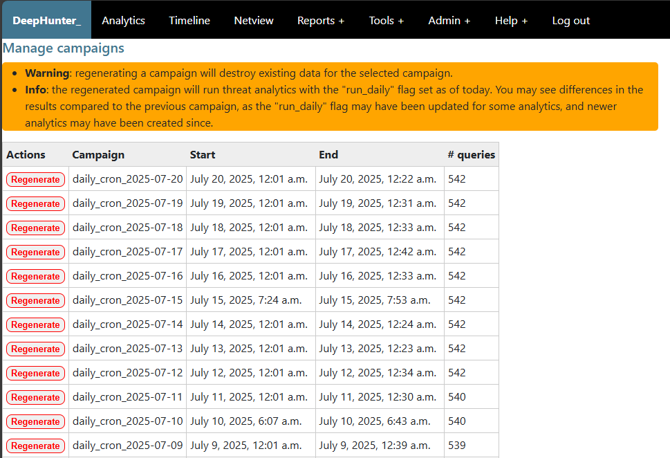

Manage campaigns
################

Description
***********

Campaigns are meant to be executed via the cron job on a daily basis. However, it may happen that you want to re-run a campaign manually (e.g. in case of campaign failure).

This module allows you to manage campaigns, including starting and stopping campaigns.

Warning
*******

- regenerating a campaign will destroy existing data for the selected campaign.
- the regenerated campaign will run threat analytics with the "run_daily" flag set as of today. You may see differences in the results compared to the previous campaign, as the "run_daily" flag may have been updated for some analytics, and newer analytics may have been created since.
