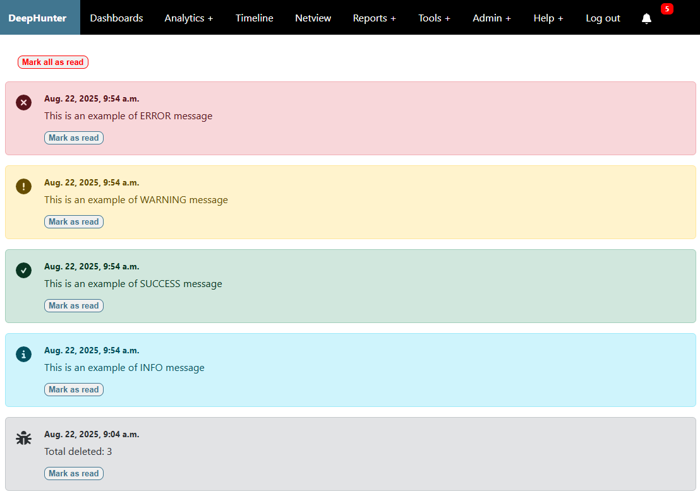

Notifications
#############

Notifications appear in the top navigation bar menu, after the bell icon. A badge is showing the number of notifications in real time.

Recipients
**********
Recipients are managed through the `NOTIFICATIONS_RECIPIENTS <../settings.html#notifications-recipients>`_ setting, where you can define which users or groups should receive notifications for each notification level.

Levels
******
There are 5 levels of notification messages:

- **DEBUG**: Debug messages, only for development or troubleshooting purposes. Typically triggered when the ``DEBUG`` flag is set to ``True`` in scripts.
- **INFO**: Informational messages (e.g., a new version is available)
- **SUCCESS**: Success messages (e.g., a task completed successfully)
- **WARNING**: Warning messages (e.g., a token is about to expire)
- **ERROR**: Error messages (e.g., a task failed or a token has expired)

Acknowledge messages
********************

Users can acknowledge notifications by clicking the ``mark as read`` or ``mark all as read`` buttons in the UI. This will mark the notification as read and remove it from the unread count.

Read messages are no longer visible in the UI, but not deleted from the database. Only the admin can restore them by setting the ``is_read`` flag back to ``False``.

Auto delete
***********

In order to automatically delete notifications after a certain period, you can configure the `AUTO_DELETE_NOTIFICATIONS_AFTER <../settings.html#auto-delete-notifications-after>`_ setting in your `settings.py` file. This setting allows you to specify the number of days after which notifications of each level will be deleted.

.. note::

    Notice that some messages will be automatically deleted when no longer relevant (e.g., when a token has been renewed after a previous expiration notification was sent).
