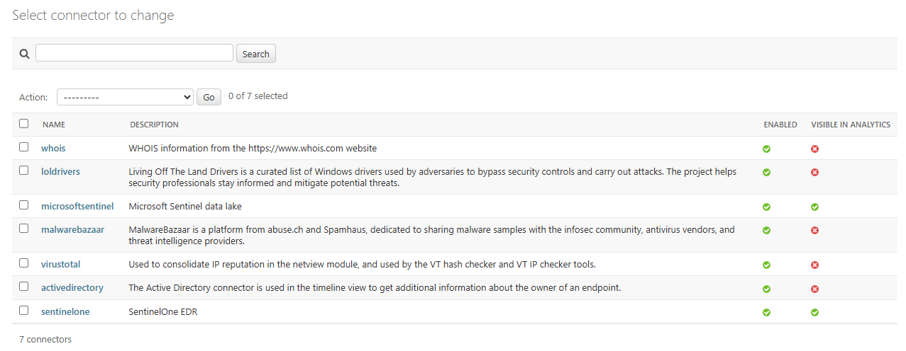
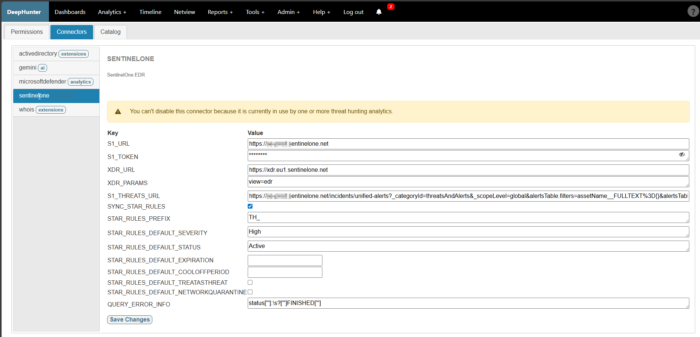

Plugins
#######

Description
***********
A plugin is the abstraction layer that allows DeepHunter to interact with different data sources (e.g. SentinelOne, Microsoft Sentinel, etc.) to execute queries, retrieve results, synchronize rules, etc.

There are 2 types of plugins:

- plugins that are used in the threat hunting analytics (e.g. sentinelone, microsoftsentinel, etc.) to execute queries against a remote data lake and retrieve results, synchronize rules, etc.
- plugins that are used to enrich data with additional information (e.g. active directory), or used in tools (e.g. malwarebazaar, virustotal).

Plugins' settings should be stored in the database (Connector and ConnectorConf objects). The plugin's code should be stored in the `plugins` folder.

Enable / disable plugins
************************

To enable or disable plugins, go to the admin panel (``/admin/connectors/connector/``).

Settings
********
You can configure each connector from the ``Admin > Settings > Connectors`` menu in DeepHunter.

Refer to each plugin to get more information about its specific requirements, functionality and settings.

Plugins
*******
.. toctree::
   :maxdepth: 1
  
   activedirectory
   loldrivers
   malwarebazaar
   microsoftdefender
   microsoftsentinel
   sentinelone
   virustotal
   whois
   write_your_own