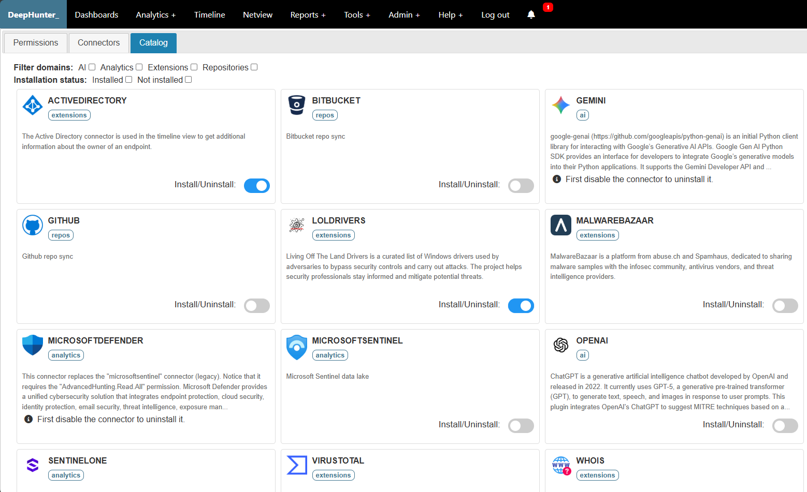

Plugins
#######

Description
***********
A plugin is the abstraction layer (a.k.a. connector) that allows DeepHunter to interact with different data sources (e.g. SentinelOne, Microsoft Sentinel, etc.) to execute queries, retrieve results, synchronize rules, consolidate results, etc.

There are several categories (a.k.a. domains) of plugins:

- **AI**: plugins that are used to interact with AI services (e.g. OpenAI). Currently used to write a query based on user input and to determine the MITRE coverage of analytics.
- **Analytics**: plugins that are used in the threat hunting analytics (e.g. sentinelone, microsoftsentinel, etc.) to execute queries against a remote data lake and retrieve results, synchronize rules, etc.
- **Extensions**: plugins that are used to enrich data with additional information (e.g. active directory), or used in tools (e.g. malwarebazaar, virustotal).
- **Repositories**: plugins that are used to import threat hunting analytics from remote repositories.
- **Authentication**: plugins that are used to authenticate users (e.g. PingID, Entra ID).

Plugins are python files within the ``./plugins/catalog`` directory. Plugins settings are stored in the database (Connector and ConnectorConf objects).

catalog
*******
The catalog is the list of available plugins.

You can install and uninstall plugins from the catalog.

.. note::

  * DeepHunter will check that prerequisites are met before installing a plugin (i.e., required python packages are installed). If missing prerequisites are detected, the installation will fail.
	
  * You can't uninstall plugins that are currently in use. To uninstall a plugin that is in use, you must first remove all references to it (e.g. remove all analytics that use the plugin, or map them to another plugin).
  
  * You need to first disable a plugin before uninstalling it.

When a plugin is installed, a symbolic link is created in the ``./plugins/`` directory pointing to the corresponding file in the ``./plugins/catalog/`` directory.

Enable, disable and configure plugins
*************************************
You can enable, disable and configure each connector from the ``Admin > Settings > Connectors`` menu in DeepHunter.

.. image:: ../img/connector_settings.png
  :width: 800
  :alt: Connector settings

Refer to each plugin to get more information about its specific requirements, functionality and settings.

Plugins
*******
.. toctree::
   :maxdepth: 1
  
   activedirectory
   entraid
   gemini
   loldrivers
   malwarebazaar
   microsoftdefender
   microsoftsentinel
   openai
   pingid
   sentinelone
   virustotal
   whois
   write_your_own