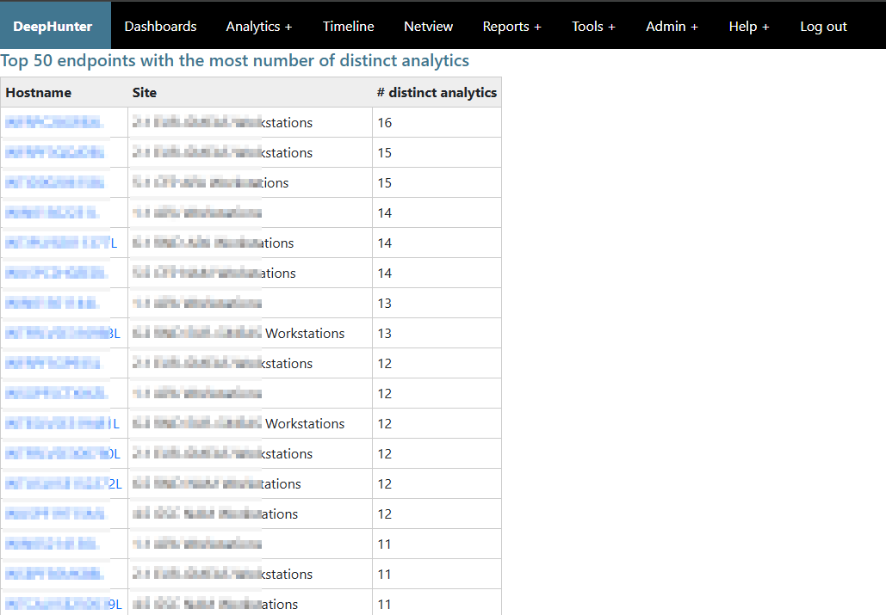

Endpoints with most number of distinct analytics
################################################

This report shows the top 50 endpoints with the most number of distinct analytics associated with them, ordered by the number of distinct analytics in descending order.

Hostnames are clickable and will redirect to the `timeline <../modules/timeline.html>`_ module, where you can see more details about the endpoint.