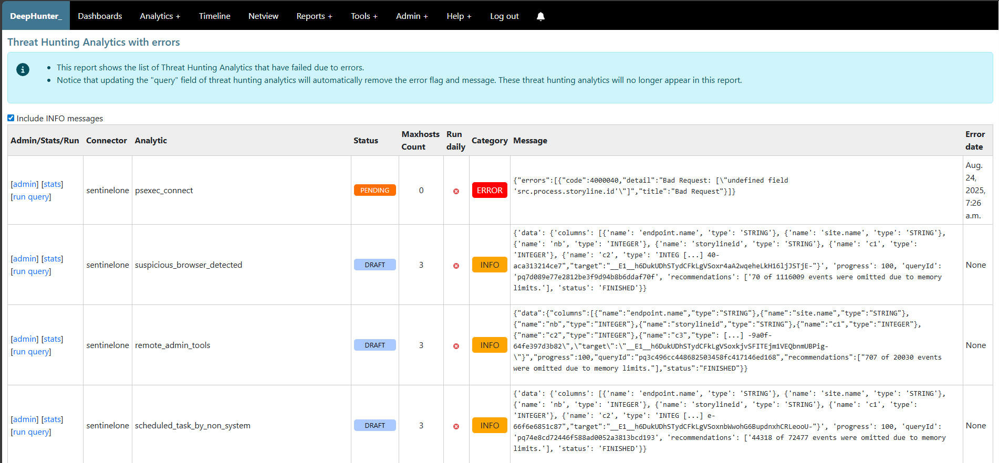

Threat Hunting Analytics with errors
####################################

This report shows the list of Threat Hunting Analytics that triggered messages (e.g. errors, recommendations, etc.) during a campaign or a statistics regeneration process. Both the error flag and the error message will be automatically removed at the next campaign (if the analytic's run_daily flag has not been automatically unset), or when the threat hunting analytic's query field will be updated.

Notice that the "error date" field corresponds to the date when the campaign has run. When a campaign is regenerated retroactively, the snapshot date for the events will correspond to the retroactive date of the campaign, but the error date will correspond to the current date when the campaign was regenerated. This is done to investigate on potential datalake-related issues.

The checkbox is a toggle to include or exclude INFO messages. By default, only ERROR messages are shown when the page loads.

