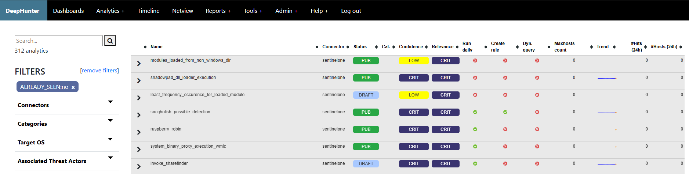

Threat Hunting Analytics with zero occurrences
##############################################

This report shows Threat Hunting Analytics that never matched any endpoint, beyond the data retention (thanks to the "last_time_seen" field). Notice that this field is automatically reset when the "query" field of an analytic is changed.

