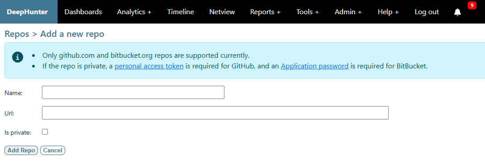

Add a repository
################

To add a new repository, navigate to the `list repos <list_repos.html>`_ view and click the ``add a new repo`` button.

Repositories currently supported are public GitHub and BitBucket repos.

If the repo is private, you will need:

- a `Private Access Token (PAT) <https://github.com/settings/personal-access-tokens>`_ for GitHub Repositories
- an `Application password <https://bitbucket.org/account/settings/app-passwords/>`_  for BitBucket repositories

