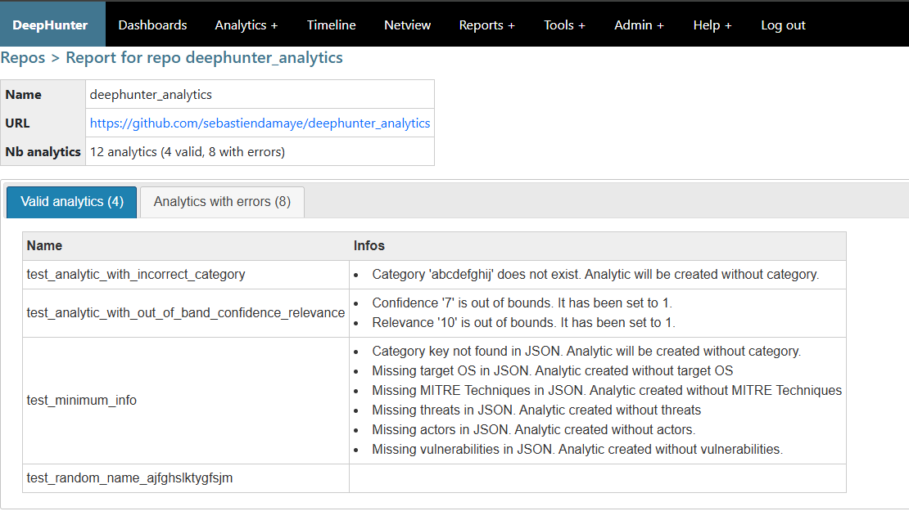

Check a repository
##################

This allows you to check the status of an existing repository. It is recommended to perform this action prior to importing analytics from a repo (``sync`` button).

It will perform various checks, including:

- Validating repository access
- Checking the JSON format
- Checking analytics consistency (see `expected format <index.html#expected-format-for-repositories>`_)

After checking the remote repositories, you will get a detailed report with 2 tabs, showing valid analytics (along with information), and errors.

The **check** operation won't apply any change to your database. It will only perform checks.

