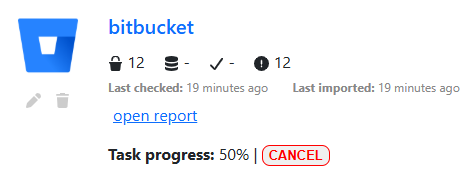

Import a repository
###################

Importing analytics
*******************

The `import` button from the `list repos <list_repos.html>`_ view allows you to import analytics from the remote repository into DeepHunter. It is highly recommended to first do a `check <check_repo.html>`_.

.. note::
    - By default, imported analytics will be in draft mode (or whatever status you have defined in your settings). You can also define if the imported analytics should be included in the campaigns by default.
    - DeepHunter can automatically create missing categories, threats, actors and vulnerabilities if they are missing. Check the settings section for more information.
    - Target OS and MITRE techniques won't be automatically created. If they are not in your database, the analytic will be created with empty values.
    - Vulnerabilities base score will default to 0

You will first need to select the analytics you want to import. You can click the `preview` button to preview each analytic.

The import process is also performing a `check <check_repo.html>`_ of all analytics, but only selected analytics will be ingested in the database. This process is done in the background (it will continue running even if you leave the page). You can stop it anytime by clicking the "CANCEL" button.

Once the import is complete, you will be presented with a detailed `report <report.html>`_.

Updating analytics from a previous import
*****************************************

If you are importing analytics that were imported from a previous import (from the same repo), they will be updated with the new data but the **status** and **run_daily** fields.

Warnings
********

If you have configured DeepHunter to automatically generate statistics for your analytics (`AUTO_STATS_REGENERATION <../settings.html#auto-stats-regeneration>`_), be aware that statistics will be generated for all of the imported analytics, which could lead to an increasing load on the server. Make sure you have configured `Celery <../install.html#async-tasks-celery-redis-message-broker>`_ to run a limited number of parallel threads.