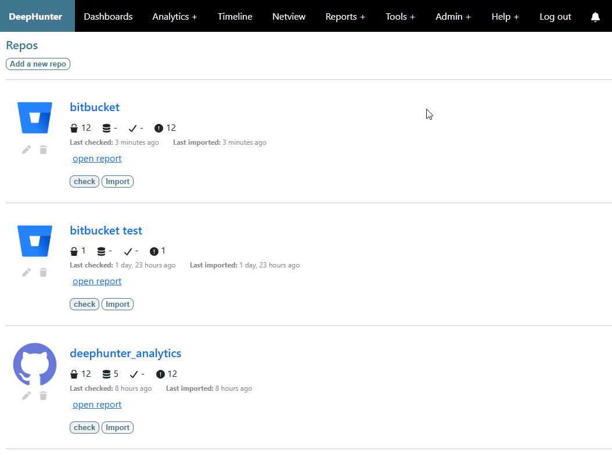

List repositories
#################

Description
***********

This is the main screen to view and manage your repositories.

The number of analytics (including valid and analytics with errors) is automatically updated when you click the ``check`` button.

  
Actions
*******
From the screen, you can manage your repositories by performing the following actions:

- `Add a new repo <add_repo.html>`_
- `Check a repository <check_repo.html>`_
- `Sync a repository <sync_repo.html>`_
- `Edit a repository <edit_repo.html>`_
- `Delete a repository <delete_repo.html>`_
