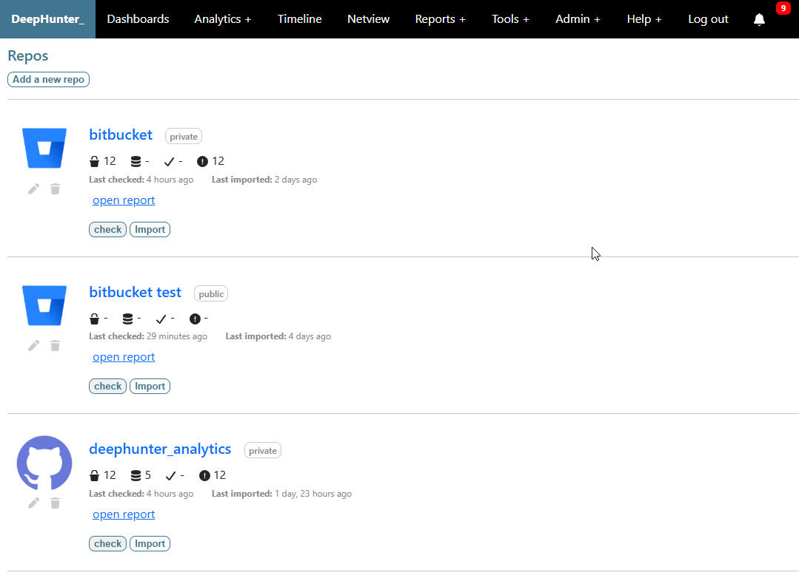

List repositories
#################

Description
***********

This is the main screen to view and manage your repositories.

Information is updated in real time (e.g. number of analytics, number of imported analytics, last imported date, etc).

  
Actions
*******
From the screen, you can manage your repositories by performing the following actions:

- `Add a new repo <add_repo.html>`_
- `Check a repository <check_repo.html>`_
- `Import a repository <import_repo.html>`_
- `Edit a repository <edit_repo.html>`_
- `Delete a repository <delete_repo.html>`_
- `Open the report <report.html>`_
