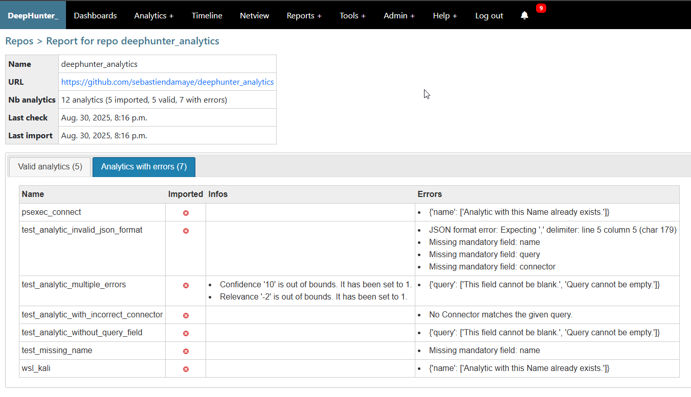

Report
######

A detailed report is created after a `check <check_repo.html>`_ of `import <import_repo.html>`_ operation. 

It shows the analytics of the repo, broken down into 2 tabs, showing valid analytics (along with information), and errors.

