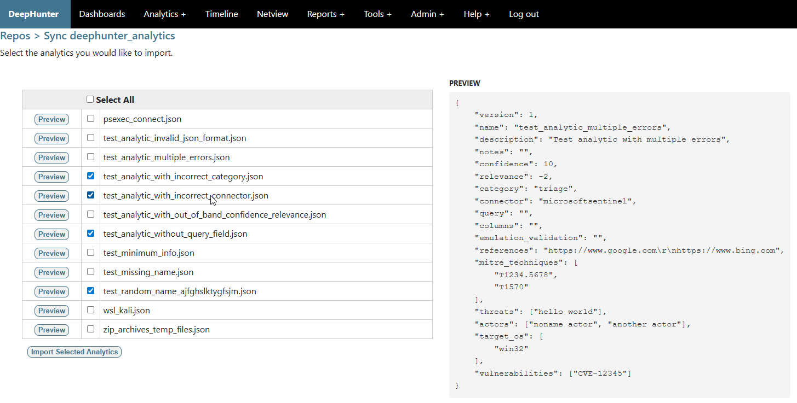

Sync a repository
#################

Importing analytics
*******************

The `sync` button from the `list repos <list_repos.html>`_ view allows you to import analytics from the remote repository into DeepHunter. It is highly recommended to first do a `check <check_repo.html>`_.

Notes about the imported analytics:

- By default, imported analytics will be in draft mode (or whatever status you have defined in your settings). You can also define is the imported analytics should be included in the campaigns by default.
- DeepHunter can automatically create missing categories, threats, actors and vulnerabilities if they are missing. Check the settings section for more information.
- Target OS and MITRE techniques won't be automatically created. If they are not in your database, the analytic will be created with empty values.
- Vulnerabilities base score will default to 0

You will first need to select the analytics you want to import. You can click the `preview` button to preview each analytic.

Once the import is complete, you will be presented with a detailed report with 2 tabs (one for valid analytics, successfully imported, and one for invalid analytics with errors), as depicted below.

.. image:: ../img/check_repo.png
  :alt: analytics_to_review

Warnings
********

If you have configured DeepHunter to automatically generate statistics for your analytics (`AUTO_STATS_REGENERATION <../settings.html#auto-stats-regeneration>`_), be aware that statistics will be generated for all of the imported analytics, which could lead to an increasing load on the server. Make sure you have configured `Celery <../install.html#async-tasks-celery-redis-message-broker>`_ to run a limited number of parallel threads.