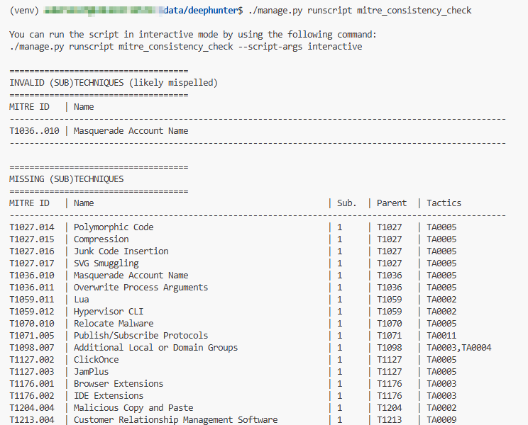
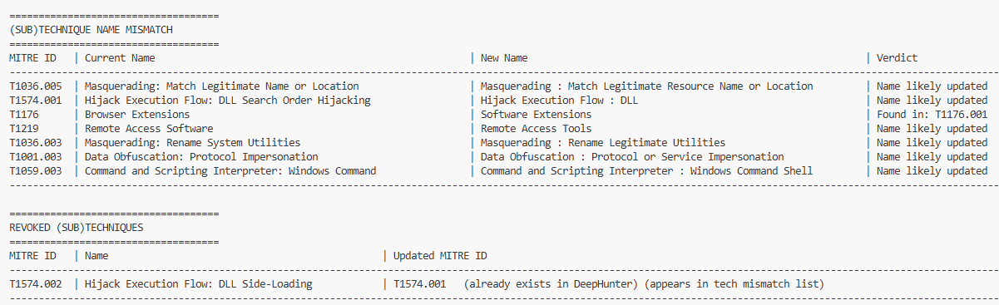

mitre_consistency_check.py
##########################

Description
***********

The ``mitre_consistency_check.sh`` script is used to verify the consistency of the MITRE ATT&CK framework data within DeepHunter. It checks for any discrepancies or missing data.

Execution modes
***************

The script can be executed in two modes:

- **report**: this mode will only show inconsistencies without making any changes. It will also show some warnings.

.. code-block:: shell

    ./manage.py runscript mitre_consistency_check

- **interactive**: this mode will ask the user for confirmation before making any changes to the data.

.. code-block:: shell

    ./manage.py runscript mitre_consistency_check --script-args interactive

The script is meant to be run manually only.

Screenshots
***********

