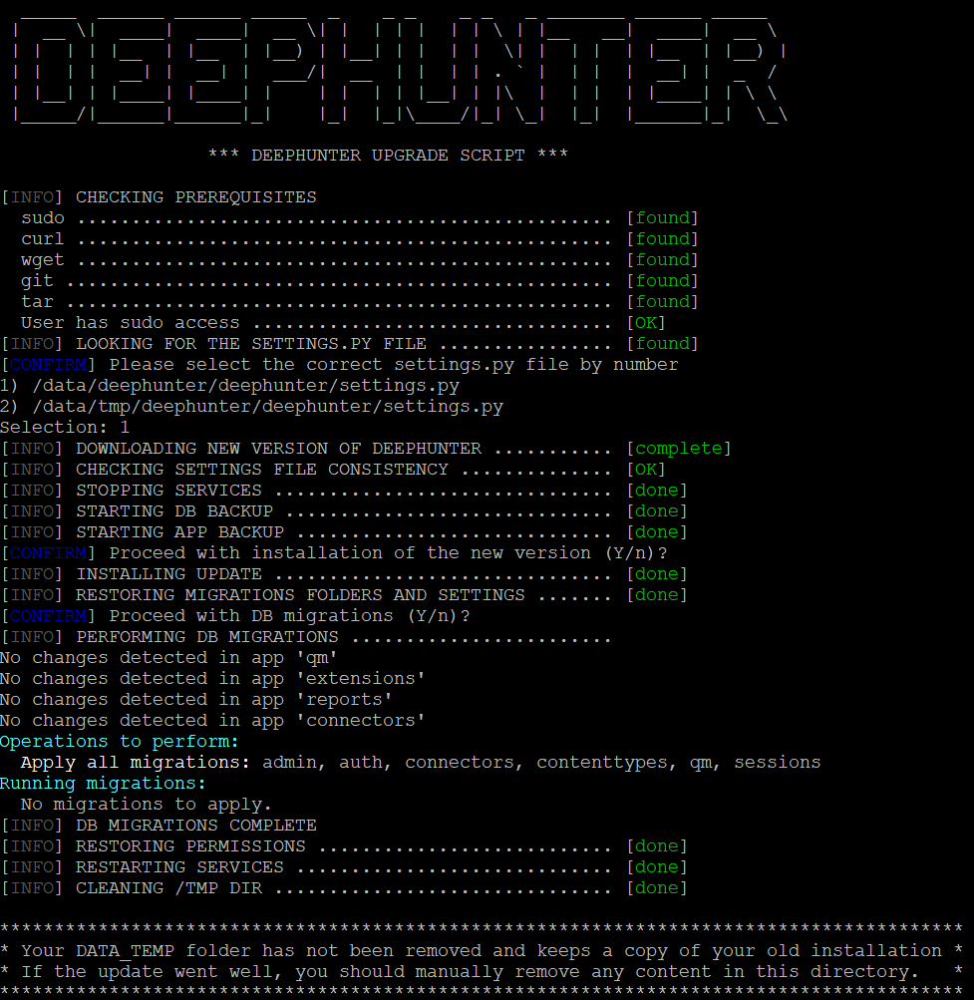

upgrade.sh
##########

The ``upgrade.sh`` script is used to upgrade DeepHunter when a new version is available on GitHub. It takes care of backing up the current configuration and data, downloading the latest version, applying the upgrade, restarting services and restoring permissions.

It will generate a log file named ``upgrade.log`` in `/tmp`, but you can directly see the output if you call the script with the `-v` (verbose) option.

