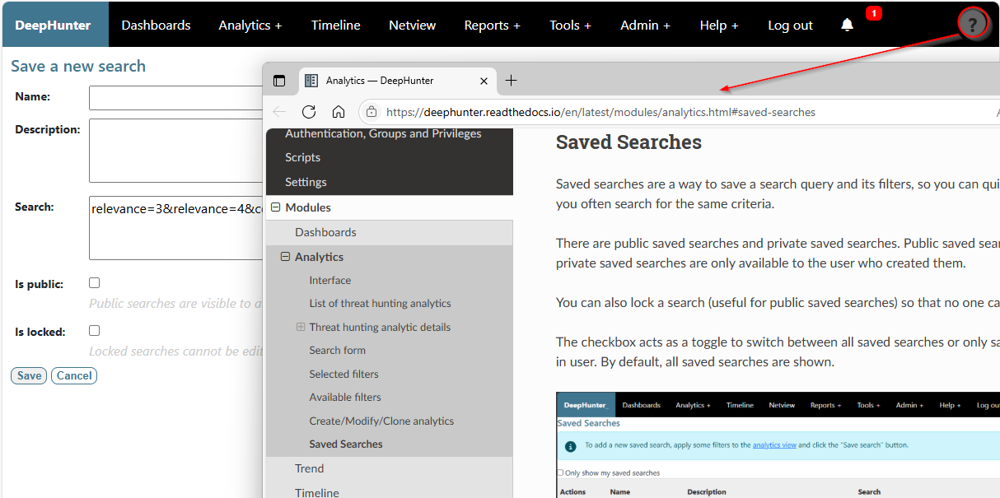

Support
#######

Help Marker
***********

A help marker appears on the top right corner of the screen. Clicking on it will redirect you to the appropriate section of the documentation.

Report an issue
***************

To report an issue, go to the `DeepHunter GitHub project <https://github.com/sebastiendamaye/deephunter/issues>`_ and click on the "New issue" button.

DeepHunter is developed and maintained by Sébastien Damaye, under the `MIT license <https://github.com/sebastiendamaye/deephunter?tab=MIT-1-ov-file>`_. You are free to download, clone and modify the application.

If you have developed a `new tool <tools/develop_your_own.html>`_ or a `new plugin <plugins/write_your_own.html>`_, you can `contact me <https://spamty.eu/show/v7/332/97a34d6485/>`_ if you think it may be interested to integrate it in DeepHunter.